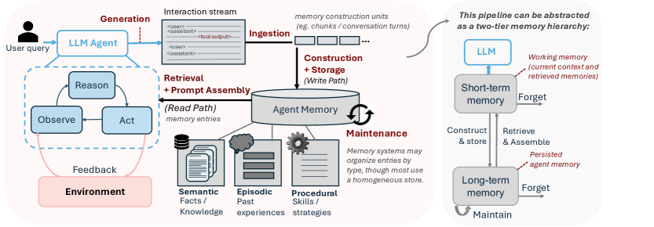
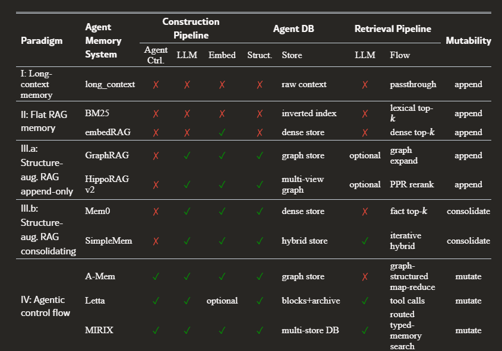

# 🧠 如何成为「记忆工程师」——从斯坦福、微软、Anthropic 和 NVIDIA 的视角

> 原文推文：[@N01ennn](https://x.com/N01ennn/status/2083971749079581120)
>
> 完整原文：https://threadnavigator.com/thread/2083971749079581120/

---

你的 Agent 在记忆上最贵的操作，是你从没看过的那部分。你调了检索、测了准确率、但从来没给写路径标过价。你也没注意到，你的存储系统什么都不忘。

每个做 Agent 记忆的人都在优化它记住了什么。几乎没有人去工程化它构建花了多少钱、什么值得保留、谁能删除它、以及它到底在哪里撞上了硬件。

这个缺口，就是「记忆工程师」（Memory Engineer）这个岗位的全部内容。

这不是一篇教你装个向量数据库就完事的文章。这是一份拆成 15 步、跨 4 个实验室的职位说明书。从头读到尾，你会从「存储工」变成「记忆工程师」。

---

## 看清记忆的本质

### Step 1：停止把「存储」叫做「记忆」

你随时能给 Agent 装上记忆——打开一个向量数据库、灌进历史、top-k 检索，搞定。

那套方法一直管用，直到：历史撑爆了上下文窗口、写路径的花费比查询还贵、仓库里塞满了没人清理的过期状态。

真正的记忆不是一个桶——它有新陈代谢（metabolism）。它吃能量才能写入、每轮对话都在膨胀、没人修剪就会腐烂。它还会在六个月后翻出一条当时对、今天已经错得离谱的「记忆」给你用。

别把它当桶用。开始把它当成一个有成本和生命周期的系统来设计。

### Step 2：掌握四个透镜

四个实验室，每个回答一个关于记忆系统的核心难题。你得同时握住四个视角：

| 实验室 | 核心问题 |
|--------|---------|
| ▲ **Stanford** | 记住要花多少钱？ |
| ■ **Microsoft** | 什么值得记住？ |
| ◆ **Anthropic** | 谁有权管它记住了什么？ |
| ● **NVIDIA** | 记忆到底落在哪块硬件上？ |

没有一个是错的。真正的技能是——拒绝只选一个。



---

## 🔬 Part 2 · 定价：在建造之前先算账

> STANFORD

### Step 3：把注意力移到写路径（Write Path）

斯坦福做了第一个真正的 Agent 记忆系统研究，结论让人不安：**成本不在你盯着看的地方。**

所有人都在看查询时间——用户能感知的延迟。真正的账单藏在构建阶段——那个把原始历史加工成存储记录的写路径，用户永远看不到。

| 环节 | 含义 | 谁在付 |
|------|------|--------|
| 🏗️ 构建（construction） | LLM prefill + embedding | 一次付清，用户看不见 |
| 🔍 查询（query） | 检索 + 生成 | 每次付，你盯着的那部分 |
| 🧹 维护（maintenance） | 去重、压缩、遗忘 | 通常完全缺失 |

对于 LLM 驱动的记忆系统，**构建阶段消耗的能量，比之后回答 300 次查询还多。**

### Step 4：用「每次正确答案的能量」来衡量，而不是准确率

准确率会藏起账单。

把能量消耗除以正确答案数——两个准确率完全一致的系统，差距拉到了 **47 倍**。

同一个任务，同一块 GPU，47 倍的差距，任何准确率评测都不会告诉你。

从现在起，每个记忆系统都要报两个数字：**质量**和**每次正确答案的成本**。只报第一个不报第二个算作弊。

### Step 5：选择你的成本——没有最好的系统

斯坦福把记忆系统分成四个家族：

- **原始上下文**（raw context）
- **平面检索**（flat retrieval）
- **结构化提取**（structured extraction）
- **全 Agent 驱动**（fully agentic）

没有一个能在构建成本、查询速度和准确率上同时获胜。

像 **Mem0** 这样的系统，回答只需不到 0.1 秒，但构建要花几千秒。词法索引构建瞬间完成，但查询时又慢又粗糙。

所以记忆工程师不做的事：选「最好的系统」。做的事：有意识地选择承担哪种成本。



---

## 🪟 Part 3 · 决定什么值得记住

> MICROSOFT

### Step 6：存事实（Facts）和技能（Skills），不要存日志

微软的 **PlugMem** 以一个不太舒服的结论开场：

**给 Agent 塞更多原始记忆，反而可能让它更差。** 历史越堆越高、检索被淹没、Agent 把注意力全浪费在翻聊天记录去找那一句有用的话上。

解决方法偷师自人类记忆：我们不回放事件，我们保留从中提取的**事实**和**技能**。

❌ 别存这个：

> "5月12日，用户说：我一直都用 GitHub Actions 部署，从不手动的，那次生产事故之后学乖了……"

✅ 存这个：

> fact：用户通过 GitHub Actions 部署，从不手动操作
>
> skill：部署失败时，先查 Actions 运行日志，再碰生产环境

### Step 7：用实用性（Utility）来评判记忆，而不是大小

存成事实和技能后，一个通用记忆模块在三个不同的任务上打败了专用设计，token 消耗反而更少。

优化指标不是你存了多少，而是每花一个 token 的上下文，Agent 拿到了多少决策相关的信息。

密度碾压数量，次次都赢。

### Step 8：让模型自己管理自己的上下文

微软的 **Memento** 把记忆推进了模型内部：按块推理、给自己写一段稠密笔记、然后删除原始推理过程。峰值内存降低 2-3 倍，吞吐量几乎翻倍。

要从 Memento 拿走两个教训：

1. 这是一项从普通微调就能习得的技能，不是额外贴上去的编排层
2. **被擦除的推理并没有完全消失**——阴影还活在模型内部。仅靠笔记重建上下文，准确率下降 15 个点

遗忘 ≠ 删除，记住 ≠ 存储。这一条值得反复咀嚼。

---

## 🟠 Part 4 · 把控制权抓在自己手里

> ANTHROPIC

### Step 9：把记忆做成你可以删除的文件

Anthropic 的做法几乎有点无聊——而这就是重点。

**把记忆做成文件系统上的文件**，这样 Agent 用自己已有的工具就能读写。

这么做的好处是文件能带来的一切：导出、检查、程序化控制——精确到 Agent 脑子里留了些什么。

一个你不能打开和编辑的存储，就是一个你不拥有的存储。

### Step 10：作用域、审计、回滚

一条错误的记忆不会只失败一次——它会在每一个读到它的未来会话中持续毒害。

所以控制不是记忆之上的附加层——它本身就是设计。

```
/memory
  /org
    只读: conventions.md, past-incidents.md
  /user-4821
    读写: preferences.md, skills/
  audit.log
    哪个Agent、哪个会话、改了什么、什么时间
    → 导出、回滚、或删除任何记忆
```

按作用域划分读写权限，保留学习痕迹的审计日志，保留伸手进去删除的能力。

做对了，效果是可测量的：这样设计的团队，首次决策错误率降低了 **97%**，验证速度提升了约三分之一——因为学习过程始终保持可观测。

---

## 💚 Part 5 · 让记忆扛住硬件

> NVIDIA

### Step 11：把记忆当 KV 缓存读，别当文本读

剥掉所有算法，每一个记忆决策最终都落在 GPU 上。

把完整历史留在上下文里不只是慢——它是**二次方的**。前缀缓存（prefix caching）在会话内能救你，但跨会话直接归零。

所有这些压力汇聚到一个稀缺资源上：高带宽内存（HBM）中的 **KV 缓存**。

记忆工程师用这些数字来思考：HBM 带宽、GPU 利用率、每秒 token、释放的 KV 插槽数。因为不管上层算法多花哨，底层的硬通货始终是缓存。

| 方案 | 代价 |
|------|------|
| 全量上下文 | 成本随长度²增长，KV 缓存填满 HBM，跨会话被驱逐 → 下次重付 |
| Memento on vLLM | 完成一个推理块 → 刷新它的 KV 条目 → 释放的插槽还给池子 |

B200 实测结果：4,290 tok/s vs 原版 2,447 tok/s，同一批次 693s vs 1,096s

### Step 12：把构建当成后台任务

构建几乎是纯 prefill——长读入、短写出——行为就像一个后台索引任务。

把它和实时查询放一起——一个大写入刚好会在用户查询到达时卡住调度器。

限速它、批量处理它、或者推迟执行。把它从延迟敏感的路径上挪开。你不是在保存文本——你是在为真正重要的查询释放缓存。

---

## 🛠️ Part 6 · 别把自己也搭进去

### Step 13：先手工验证每一个流程

在你安排任何自动运行之前，先手工跑一次。让 Agent 面对你的真实历史，提取事实和技能，标出矛盾点，算算保持它们新鲜要花多少钱。

如果输出真的改变了某个决策，它才配得上被排进自动化日程。

只跑了三条笔记就上线的记忆系统，会给你编造不存在的连接，然后训练你忽略它。先手工跑通，再自动化。

### Step 14：在仓库膨胀之前，先加上遗忘策略

斯坦福测试的所有系统，默认都不做修剪或遗忘。存储只做一件事：膨胀。

一百万个 token 时，不同系统之间的差距可达 **9 倍**。全 Agent 驱动系统更糟——仓库本身越涨越大。

增长速度，不是初始规模，才是拖垮一个长生命周期 Agent 的根因。

在仓库变大之前加上去重（dedup）、合并（consolidation）和明确的遗忘规则。

还有一条铁律：永远不要自动合并矛盾记忆。两条矛盾的记忆可能在各自语境下都是对的——系统把它展示出来，由你做决定。

### Step 15：按这个顺序上线

1. **先构建写路径**——存储事实和技能。让它跑个几周，攒够真实素材
2. **手工加几次矛盾检测**——只有当你发现冲突让你意外时，才把它调度起来
3. **在数据量爬升之前**——加上遗忘和维护策略
4. **最后调硬件层**——等数据量真实了再说：批量构建、限制检索、盯着 KV 缓存

不要第一天就把所有东西都调度起来。先让一轮手工跑得可靠，把它封装好，再自动化。

---

## 这到底意味着什么？

每个记忆系统都给你同样的承诺：它永远不会忘、它能在意模式、它会变成一个活的仓库，存着你喂给它的所有东西。

没问题。那是这份工作容易的一半——记住的部分。

记忆工程师干的是另一半。

不是「这是我保留的所有东西」，而是「这是我选择不保留的、这是我蒸馏过的、这是我趁它腐烂之前修剪掉的、这是我为了给下一批腾地方而清掉的」。

斯坦福、微软、Anthropic 和 NVIDIA 是同一个动作的四种语言——**决定放弃什么**。

你的 Agent 的问题从来不是记不住。它是从不会**刻意**忘记。

一个「存储工」优化系统记住了什么。

一个「记忆工程师」优化系统忘记了什么。

你不是靠给 Agent 一个更大的记忆来成为记忆工程师的。你成为记忆工程师的那一刻，是你开始工程化它的遗忘的时候。

---

**来源：**

- Stanford：*Agent Memory: Characterization and System Implications*
- Microsoft Research：*PlugMem, Memento*
- Anthropic：*Built-in Memory for Claude Managed Agents*
- 硬件框架来自 H100、vLLM 以及 Stanford 和 Memento 论文中的 B200 配置
